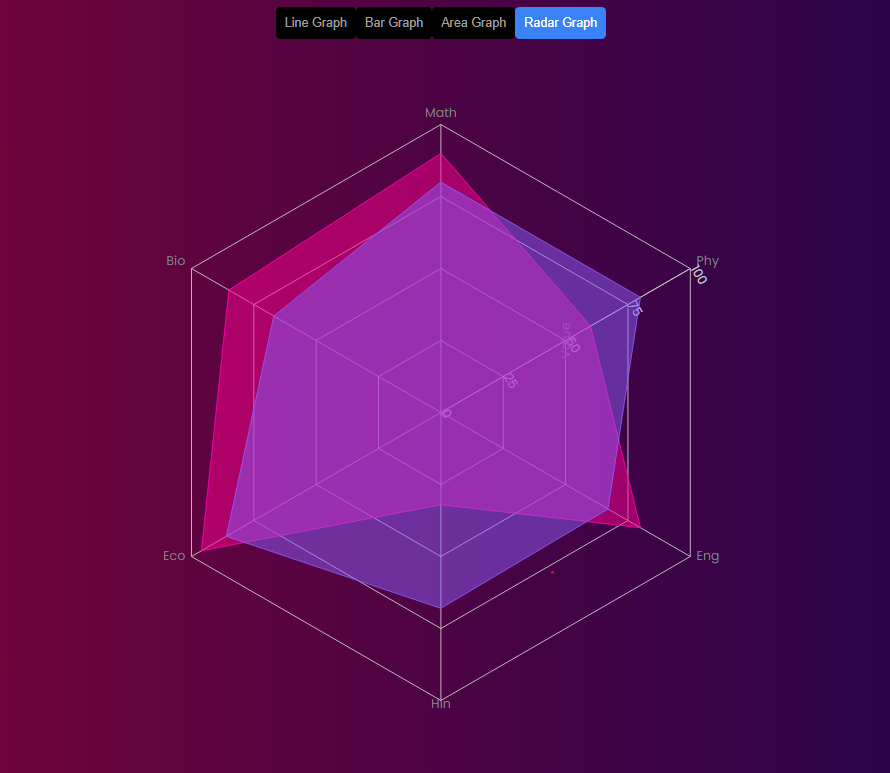

# Exposition-Assignment

This is the repository for my Exposition Assignment.

## Live Website

You can view the live website here:  
[https://Kshitij013.github.io/Exposition-Assignment]

## Composable Charting with Recharts: A Guide for React Developers

### Introduction

Recharts is a composable charting library built with React components, designed to make the process of building interactive, customizable, and highly responsive charts simple and efficient. With Recharts, developers can create beautiful and powerful visualizations for their applications, enabling users to analyze data with ease. It offers a variety of chart types such as line, bar, pie, and scatter plots, all while keeping a focus on the React ecosystem for smooth integration.

### Installation & Setup

To get started with Recharts, you'll need to install it in your React project. Here are the installation steps:

1. **Install Recharts via npm**:

   ```bash
   npm install recharts
2. **Import the necessary components into your React component file**:

   ```javascript
   import { LineChart, Line, XAxis, YAxis, CartesianGrid, Tooltip, Legend, ResponsiveContainer } from 'recharts';
### Key Features & Explanation
* Composable Components: Recharts is built with composable React components, which means you can easily add or remove chart elements (e.g., lines, axes, legends) to customize the chart’s behavior and appearance.
* Responsive Design: Recharts supports responsive chart rendering, ensuring that your charts adjust according to the screen size, making them perfect for both desktop and mobile views.
* Customizable: You can customize everything from chart styles, colors, and labels to animation settings and data formats.
* Interactive: Recharts allows for interactive charts that can handle tooltips, legends, and hover effects, giving users an engaging experience when exploring data.

### Code Examples

#### Example: Area Chart

Here’s an example of how to create an interactive **Area Chart** using Recharts in a React component:

```javascript
import React from 'react';
import { AreaChart, Area, XAxis, YAxis, CartesianGrid, Tooltip, Legend, ResponsiveContainer } from 'recharts';

export const AreaGraph = ({ data, xLabel, yLabel }) => {
  return (
    <ResponsiveContainer width="100%" height='100%'>
      <AreaChart data={data} margin={{ right: 30 }}>
        <CartesianGrid strokeDasharray="3 3" />
        <XAxis 
          dataKey="name" 
          label={{ value: xLabel, position: 'insideBottomRight', offset: -10, color:'#000000' }} 
          tick={{ fill: 'white' }} 
        />
        <YAxis 
          label={{ value: yLabel, angle: -90, position: 'insideLeft', color:'#000000' }} 
          tick={{ fill: 'white' }} 
        />
        <Tooltip content={({ payload }) => {
          if (payload && payload.length) {
            return (
              <div>
                <strong>{payload[0].name}</strong>: {payload[0].value}
              </div>
            );
          }
          return null;
        }} />
        <Legend />
        <Area
          type="monotone"
          dataKey="product1"
          stroke="#2563eb"
          fill="#3b82f6"
          stackId="1"
        />
        <Area
          type="monotone"
          dataKey="product2"
          stroke="#7c3aed"
          fill="#8b5cf6"
          stackId="1"
        />
      </AreaChart>
    </ResponsiveContainer>
  );
};
```
### Key Points:

1. **Component**: The `AreaGraph` component is reusable, and you can pass `data`, `xLabel`, and `yLabel` as props to customize the chart.
2. **Customization**: You can adjust the colors, styles, and labels easily.
3. **Interactivity**: The `Tooltip` displays additional data on hover, and the `Legend` shows information about each area.

---

You can copy and paste this section directly into your README. This format not only includes the code but also gives context to what the code does, which helps readers understand how to use it.

### Screenshots

**Area Chart Example**




This is an example of how your Area Chart might look when rendered in the app. The area chart visually represents the comparison between two data sets (product1 and product2), and it responds interactively when you hover over the chart.

### Use Cases

Recharts is perfect for a variety of applications, including:

- **Business Dashboards**: Visualize business metrics like sales, revenue, and customer engagement using area charts, bar charts, and line charts.
- **Data Visualization**: Recharts is ideal for displaying large datasets and trends over time, making it a great choice for analytics and reporting tools.
- **Real-Time Data**: Recharts can be used to visualize live data streams in real time, ideal for monitoring systems or data pipelines.
- **Financial Applications**: Create financial charts to display stock prices, financial performance, and other key business indicators.
- **Comparative Analysis**: Show comparative data in stacked charts or side-by-side charts to help users quickly assess differences in data points.

### Conclusion

Recharts is an easy-to-use and versatile charting library built specifically for React. It allows developers to quickly integrate responsive, interactive charts into their applications. With a variety of chart types (like area charts, bar charts, and line charts), Recharts enables developers to create dynamic and visually appealing data visualizations. By using composable components, you can customize every aspect of the charts to fit your app's requirements. Whether you are building dashboards, analytical tools, or data-driven applications, Recharts offers the flexibility you need to display data effectively and engagingly.

### References & Further Reading

- [Recharts Documentation](https://recharts.org/en-US/)
- [React Documentation](https://reactjs.org/docs/getting-started.html)
- [Recharts GitHub Repository](https://github.com/recharts/recharts)
- [Chart.js](https://www.chartjs.org/) (Alternative charting library)
- [D3.js](https://d3js.org/) (Another popular data visualization library)


